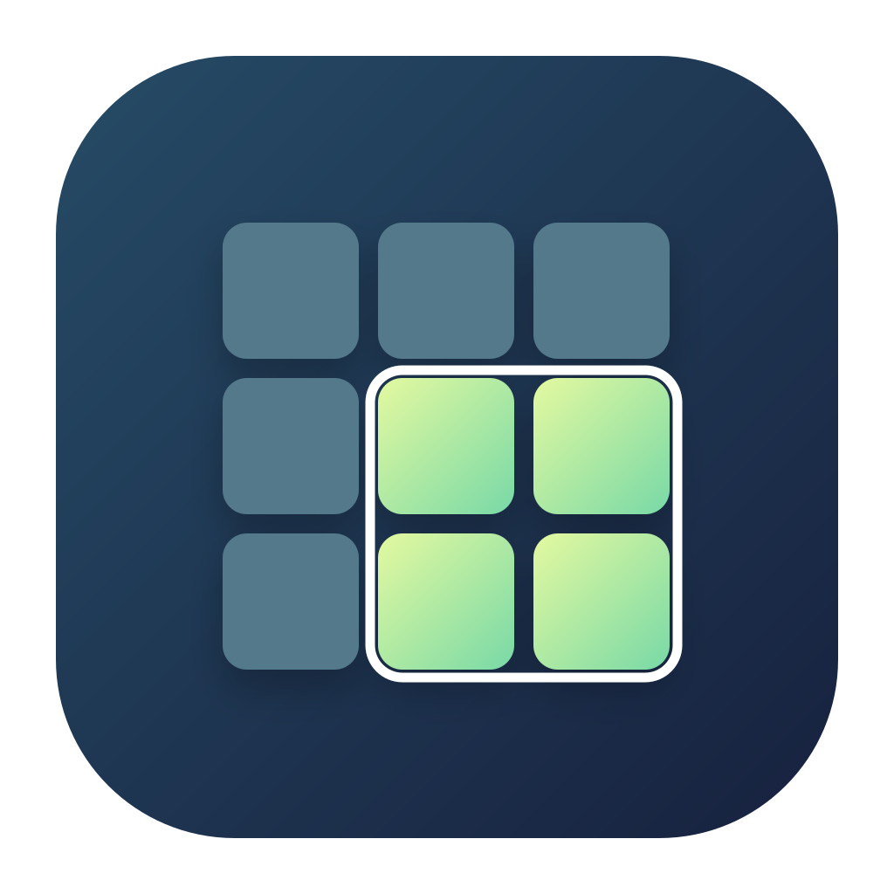

#  vindustilpasser

<p align="center"></p>  

vindustilpasser is a native macOS menu-bar utility for positioning windows of other applications. It uses AppKit, Accessibility, and Carbon hotkeys. It has no Dock icon or normal application menu.

## Build and run

Requires macOS 13 or later and Xcode Command Line Tools. Full Xcode is not needed.

```sh
make build
open build/vindustilpasser.app
```

For installation, signing, tests, and releases, see [development.md](development.md).

## Use

Press Command-F11 to open the positioning grid for the active window. Drag across cells and release to move and resize it. Arrow keys move the selection; Shift-arrow keys resize it. Hold Option for a finer grid. Press Return to apply or Escape to cancel. Clicking outside the grid or switching the active app or window closes it.

Command-F10 fills the usable screen without entering macOS fullscreen. Change grid size and add your own presets and shortcuts in Settings (Command-comma).

In Settings → General, enable **Launch at login** to add the installed app to your user’s Login Items. Turn it off to remove the app. If macOS requires approval, allow the app in System Settings → General → Login Items.

Grant vindustilpasser Accessibility access when prompted, or in System Settings → Privacy & Security → Accessibility. Some apps restrict how their windows can be resized.

## Settings screenshot


## Q&A

1. **What inspired vindustilpasser?** 

 - [Divvy](https://mizage.com/divvy/), a grid-based window manager. Its [Mac App Store version](https://apps.apple.com/us/app/divvy-window-manager/id413857545) was last updated in 2019, and it's still Intel-only.

2. **What does the name mean?** 

 - Try translating from Norwegian.

3. **What's the best way to install it?**

 - Clone this repository, then run `make build && make deploy` from its directory.

4. **Why does macOS block the app from the DMG?**

 - The DMG contains an ad-hoc signed, unnotarized app. If you trust the download, copy the app to Applications and try opening it. Then go to System Settings → Privacy & Security → **Open Anyway** and confirm. See [Apple's guidance](https://support.apple.com/en-ie/102445).

5. **Can we use macOS system keyboard shortcuts to manage windows?**

 - Yes, but less flexibly. Аnd system management works visibly slower because of animations.
